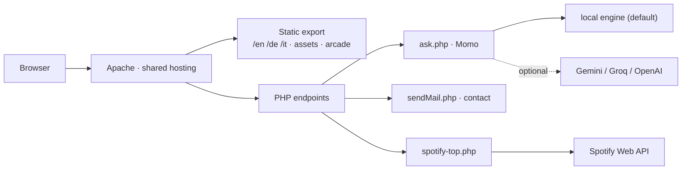

# Selina Mogicato — Portfolio

A trilingual portfolio site built with Next.js, exported as static HTML and
served from shared hosting alongside a handful of small PHP endpoints.

[](https://github.com/Selimo100/Portfolio/actions/workflows/ci.yml)


**Live site:** <https://selina.mogicato.ch>

## Overview

The site presents selected projects, background information, contact details, a
Spotify "on repeat" card, and a hidden arcade layer that adds some personality
without getting in the way of the main experience. Every page exists in English,
German and Italian, each as a real prerendered URL.

The front end ships as a fully static bundle — no Node process runs in
production. The three things that genuinely need a server (the Momo assistant,
the contact form, and the Spotify feed) are small PHP files uploaded next to it,
so the whole site deploys as one FTP upload with no build step on the host.

## Features

- **Trilingual by construction** — one route tree prerendered for EN / DE / IT,
  with all copy in a single content module rather than scattered through markup
- **Light and dark themes** with a persisted preference and no flash on load
- **Momo, a scoped assistant** that answers questions about the portfolio from a
  local knowledge base, with an optional LLM provider and a local fallback
- **Contact form** posting to a JSON PHP endpoint, with SPF-correct envelope
  handling on the server and mail capture in development
- **Spotify top-tracks card**, server-cached, degrading to a build-time snapshot
- **An arcade** of browser games behind a hotkey, plus a few easter eggs
- **Scroll-reveal motion** with proper no-JS and reduced-motion fallbacks
- **Hash-based FTPS deploy** that uploads only what changed and verifies what it
  sent

## Tech Stack

### Frontend

- Next.js 16 (App Router, `output: "export"`)
- React 19, TypeScript 5
- Hand-written CSS with design tokens — no UI framework
- Archivo (display) and IBM Plex Sans (body)

### Backend

- PHP 8.1+ for three endpoints: Momo, contact, Spotify
- Optional LLM provider (Gemini, Groq or OpenAI); a local PHP engine is the
  default and the fallback

### Infrastructure

- Apache on shared hosting (Hostfactory), static files plus PHP
- FTPS deploy over Python `ftplib`, with a hash manifest and size verification
- GitHub Actions for lint, type-check, build and PHP syntax checks

## Architecture



The static export and the PHP files are built together and uploaded together.
Full detail in [docs/architecture.md](docs/architecture.md).

## Project Structure

```text
.
├── src/
│   ├── app/
│   │   ├── layout.tsx        # <html>, fonts, theme boot script
│   │   ├── page.tsx          # Locale redirect at /
│   │   └── [lang]/           # One route tree, prerendered per language
│   ├── components/           # Header, Momo, project cards, forms, minigame
│   ├── lib/
│   │   ├── content.ts        # All copy and data, in all three languages
│   │   └── i18n.ts           # Locale list, route helpers
│   └── styles/globals.css    # Design tokens + every component style
├── server/                   # Uploaded alongside the export
│   ├── ask.php               # Momo endpoint
│   ├── sendMail.php          # Contact form endpoint (JSON)
│   ├── spotify-top.php       # Top-tracks JSON feed
│   └── lib/ data/ config/ storage/
├── public/assets/
│   ├── images/               # Portfolio and branding assets
│   └── arcade/               # Standalone arcade experience
├── scripts/                  # Build copy step, FTP deploy, prune, dev mail
├── docs/                     # Architecture, development, deployment, Momo
└── .github/                  # CI, issue forms, PR template, Dependabot
```

Content lives in exactly one place: `src/lib/content.ts`. Adding a project or
fixing wording means editing that file, in all three languages.

## Getting Started

### Prerequisites

- Node.js 20+ and npm
- PHP 8.1+ with `json` and `mbstring` (for the endpoints)
- Python 3.9+ (only for deploying)

### Installation

```bash
git clone git@github.com:Selimo100/Portfolio.git
cd Portfolio
npm install
```

### Running locally

The site needs two processes — Next for the pages, PHP for the endpoints:

```bash
npm run php    # terminal 1 — endpoints on :8001, mail captured to a file
npm run dev    # terminal 2 — the site on :3000
```

Open <http://localhost:3000>; `/` redirects to the best matching locale.
`npm run dev` alone is enough for styling work — Momo, the contact form and the
Spotify card simply 404 until PHP is running too.

### Configuration

No configuration is required to run the site: Momo falls back to its local
engine, and the Spotify card falls back to the snapshot baked into the build.

| File | Purpose |
| --- | --- |
| [`.env.deploy.example`](.env.deploy.example) | FTP credentials template — copy to `.env.deploy` before deploying |
| `server/config/openai.example.php` | Optional LLM provider config — copy to `server/config/openai.php` |
| `server/config/spotify.example.php` | Optional Spotify credentials — copy to `server/config/spotify.php` |

All three targets are git-ignored and additionally blocked from HTTP access.
Environment variables always take precedence over the config files. **Never
commit a real key.**

### Checks and build

```bash
npm run lint         # ESLint
npm run typecheck    # tsc --noEmit
npm run build        # next build + copies the PHP files into out/
npm run preview      # serve the built out/ with PHP on :8000
```

There is no automated test suite; the checks above are what CI runs, alongside
`php -l` over every file in `server/`. See
[CONTRIBUTING.md](CONTRIBUTING.md#testing) for what is verified by hand.

## Deployment

```bash
npm run build
npm run deploy:dry     # exactly what would be uploaded
npm run deploy         # upload changed files, then size-check them
```

The uploader hashes every file in `out/` and uploads only what changed, never
touching the server's credentials or runtime state. Full procedure, including
the verify and prune commands and the reason the uploader is Python, in
[docs/deployment.md](docs/deployment.md).

## Documentation

| Document | Contents |
| --- | --- |
| [docs/architecture.md](docs/architecture.md) | How the static export, the PHP layer and the arcade fit together |
| [docs/development.md](docs/development.md) | Local setup, scripts, build, and the contact-form mail pitfalls |
| [docs/deployment.md](docs/deployment.md) | FTPS deploy, verification, pruning, troubleshooting |
| [docs/momo.md](docs/momo.md) | The assistant: providers, knowledge base, rate limiting, security |

## Design Direction

The front end follows a minimal, product-style visual language: deep blue-black
surfaces with a full light palette alongside, restrained `#8ecae6` accents,
monospace for labels and metadata, hairline rules, a generous readable measure,
and subtle motion instead of heavy effects. Every token is defined once at the
top of `src/styles/globals.css`, for both themes.

## Contributing

Conventions, branch naming, commit style and the pre-PR checklist are in
[CONTRIBUTING.md](CONTRIBUTING.md). Notable changes are recorded in
[CHANGELOG.md](CHANGELOG.md).

## Security

Please report vulnerabilities privately — see [SECURITY.md](SECURITY.md). Never
open a public issue for a security problem.

## Author

**Selina Mogicato**

- Portfolio: <https://selina.mogicato.ch>
- GitHub: [@Selimo100](https://github.com/Selimo100)
- LinkedIn: [selina-mogicato](https://www.linkedin.com/in/selina-mogicato-4b7a7637a/)
