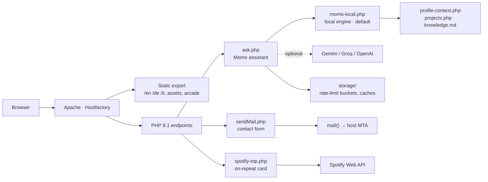
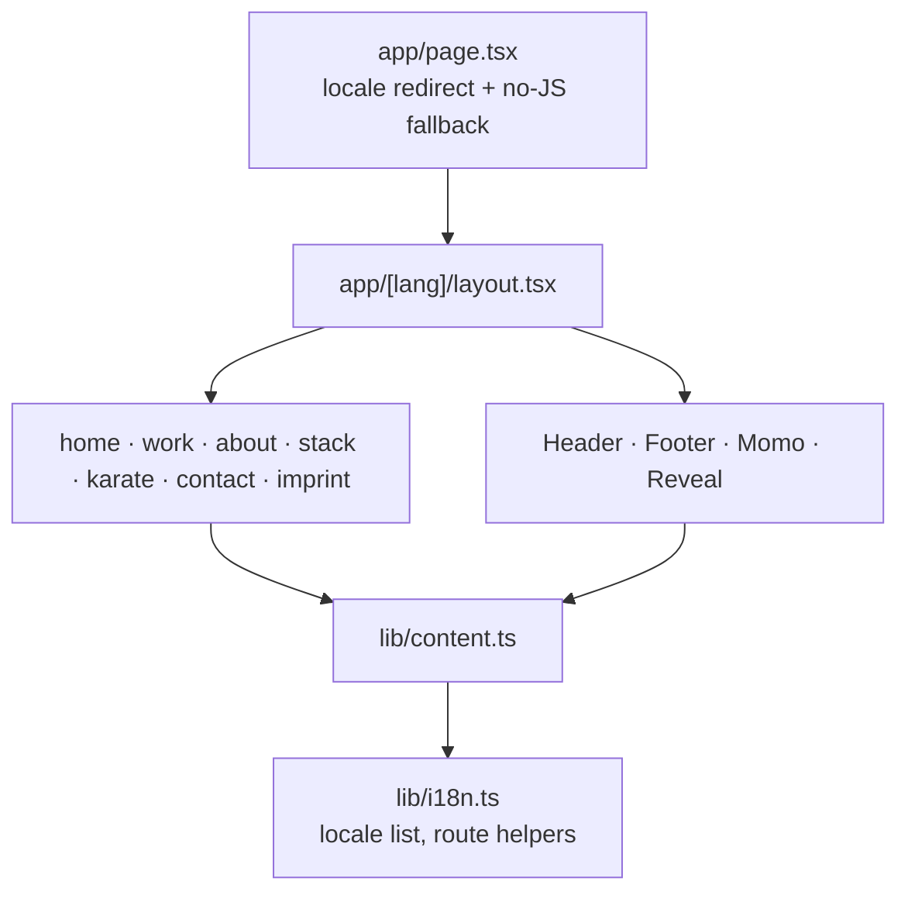

# Architecture

The portfolio is a fully static site with a small, deliberately thin PHP layer
for the three things that genuinely need a server. There is no Node process in
production, no database, and no build step on the host.

## Runtime shape

Everything under "Static export" is produced by `next build` with
`output: "export"`. Everything under "PHP endpoints" is copied next to it by
[`scripts/copy-server-files.mjs`](../scripts/copy-server-files.mjs) during the
same build, so a single upload of `out/` deploys both halves.

## Front end

Next.js App Router with `output: "export"` and `trailingSlash: true` — every
route becomes a directory with an `index.html`, which is what Apache serves for
`/work` without extra rewrites.

Three decisions carry most of the structure:

- **One route tree, prerendered per language.** `src/app/[lang]/` is generated
  once for `en`, `de` and `it`. There is no runtime translation layer: each
  language is a real, statically rendered URL.
- **Content is data, not markup.** All copy, project entries and metadata live in
  [`src/lib/content.ts`](../src/lib/content.ts), keyed by locale. Components
  render whatever that file gives them, so a wording fix never means touching a
  component — and never means touching only one language.
- **Theme is resolved before paint.** An inline boot script in the root layout
  sets `data-theme` on `<html>` from the stored preference, so there is no flash
  of the wrong palette. Client components such as `ThemeToggle` read that
  attribute after hydration rather than guessing during prerender.

Styling is hand-written CSS in
[`src/styles/globals.css`](../src/styles/globals.css) with the design tokens for
both themes declared once at the top. No UI framework and no CSS-in-JS, which is
what keeps the export small and the cascade predictable.

## Server endpoints

| Endpoint | Responsibility | External dependency |
| --- | --- | --- |
| `server/ask.php` | Momo: validation, rate limiting, provider selection, allowlisted UI actions | optional LLM provider |
| `server/sendMail.php` | Contact form; answers JSON so the page stays put | host MTA |
| `server/spotify-top.php` | Server-cached top-tracks feed with a build-time snapshot fallback | Spotify Web API |
| `server/spotify-auth.php` | One-time authorisation flow that mints the refresh token | Spotify Web API |

`config/`, `data/`, `lib/` and `storage/` each ship an `.htaccess` denying direct
HTTP access, so only the four entry points above are reachable over the web. On
Nginx these need equivalent `location` deny rules.

Two paths on the server are owned by the server and are never overwritten by a
deploy: `config/openai.php` and `config/spotify.php` (real credentials), and
`storage/` (the rate-limit salt and the Spotify cache). The build ships empty
`storage/` and `config/*.example.php` placeholders so a clean upload cannot
clobber them.

The Momo assistant has more moving parts than the others; it is documented
separately in [momo.md](momo.md).

## Arcade

`public/assets/arcade/` is a self-contained vanilla HTML/CSS/JS bundle with its
own entry point, styles and per-game scripts. It is intentionally not part of the
React app: it ships as static files, shares nothing but the theme convention, and
is excluded from linting for that reason. `ArcadeHotkey` in the Next app is the
only link between the two.

## Deployment

Static export and PHP are uploaded together over FTPS by
[`scripts/deploy-ftp.py`](../scripts/deploy-ftp.py), which hashes every file,
uploads only what changed, and size-checks what it sent. See
[deployment.md](deployment.md).
